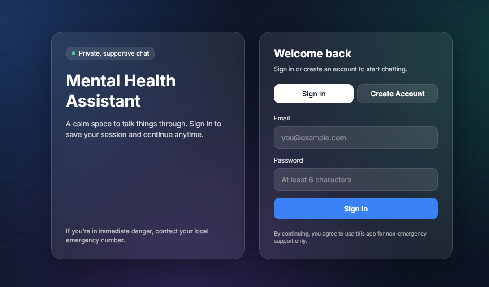
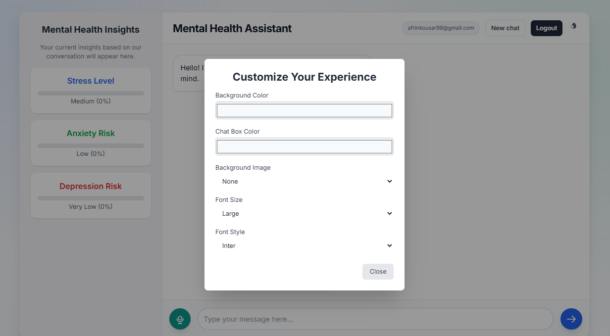

# Hybrid Mental Health Chatbot

A deployable AI-powered mental health support chatbot built with a hybrid NLP pipeline, Flask backend, authentication flow, persistent user accounts, and a live web interface.

## Live Demo

- App: https://afrin18-hybrid-mental-health-chatbot.hf.space
- Space page: https://huggingface.co/spaces/Afrin18/hybrid-mental-health-chatbot
- Source code: https://github.com/afrin2315/hybrid_chatbot

## Screenshots

### Login and account access



### Chat interface and customization panel



## Overview

This project was designed as more than a simple chatbot UI. It demonstrates how multiple AI components can be combined into a single safety-aware support application:

- a transformer-based emotion classifier for primary prediction
- a traditional machine learning classifier for fast secondary safety checks
- crisis-aware routing logic
- a conversational response layer with cloud LLM support when available
- local fallback behavior when hosted environments cannot load all model assets
- user authentication with session-based access control

The result is a full-stack demo application that can be shown as a working product on a resume, portfolio, GitHub profile, or interview walkthrough.

## Key Features

- User signup and login with hashed passwords
- Session-based authentication using Flask cookies
- Protected chat route available only after login
- Hybrid emotion classification pipeline
- Crisis-aware detection and high-priority response routing
- Guided suggestions based on predicted emotional state
- Persistent account storage using SQLite
- Live web deployment on Hugging Face Spaces
- Graceful fallback when external APIs or some heavy model artifacts are unavailable

## How the Hybrid System Works

The backend uses a layered decision flow instead of relying on only one model.

### 1. Primary emotion classification

The application first attempts to classify the user message using a DistilBERT-based text classifier. This acts as the main emotional-tagging component.

### 2. Safety check

A LinearSVC pipeline acts as a lightweight secondary classifier to support fast crisis-risk detection.

### 3. Routing logic

The backend compares outputs and applies safety rules:

- if crisis-related intent is detected with high confidence, the app returns a crisis-priority response
- otherwise, it uses the main emotional label to guide the response style

### 4. Response generation

If a `GEMINI_API_KEY` is available, the app can use Gemini for grounded supportive responses. If not, it falls back to built-in local response logic so the application still works in demo environments.

## Tech Stack

- Backend: Flask, Flask-CORS
- Frontend: HTML, Tailwind CSS, vanilla JavaScript
- ML/NLP: TensorFlow, Transformers, scikit-learn, NumPy
- Database: SQLite
- Deployment: Docker, Gunicorn, Hugging Face Spaces
- Optional API integration: Gemini

## Project Structure

- `hybrid_app.py` - main backend application, routing, auth, model loading, and chatbot logic
- `wsgi.py` - production WSGI entrypoint
- `templates/login.html` - signup and login interface
- `templates/index.html` - chatbot interface
- `saved_models/` - saved model artifacts used by the hybrid pipeline
- `assets/` - screenshots used in the project README
- `requirements.txt` - pinned dependency versions
- `Dockerfile` - Hugging Face Spaces deployment container
- `app.db` - SQLite database for user accounts

## Live Deployment Notes

This project is deployed as a Hugging Face Docker Space.

Direct app link:

- https://afrin18-hybrid-mental-health-chatbot.hf.space

Important behavior:

- the app is best tested using the direct `hf.space` link
- Hugging Face’s wrapper page can sometimes interfere with session behavior in embedded mode
- the current deployment supports account creation, login, and chat interaction from the direct app URL

## Environment Variables

The application supports these environment variables:

- `FLASK_SECRET_KEY` - required for stable and secure login sessions
- `SESSION_COOKIE_SECURE` - set to `1` for HTTPS deployments
- `SESSION_COOKIE_SAMESITE` - set to `None` for Hugging Face Space session compatibility
- `GEMINI_API_KEY` - optional, enables Gemini-generated responses
- `DB_PATH` - optional custom database path
- `HOST` - server host
- `PORT` - server port
- `ENABLE_NGROK` - optional for local tunneling

## Local Setup

### 1. Install dependencies

```powershell
python -m pip install -r requirements.txt
```

### 2. Start the app

```powershell
python hybrid_app.py
```

### 3. Open the local app

- http://127.0.0.1:5000/

## Hugging Face Spaces Deployment

This repository is configured for Hugging Face Docker Spaces.

### Required Space settings

Add these secrets or variables in the Space settings:

- `FLASK_SECRET_KEY`
- `SESSION_COOKIE_SECURE=1`
- `SESSION_COOKIE_SAMESITE=None`

Optional:

- `GEMINI_API_KEY`

### Deployment files included

- `README.md` with Hugging Face Space metadata
- `Dockerfile`
- `requirements.txt`
- application code and templates

## Current Demo Behavior and Limitations

This project is deployed successfully and is suitable for showcasing, but a few model-loading limitations remain in the hosted environment:

- some TensorFlow/Keras model artifacts do not deserialize cleanly in the current runtime
- one tokenizer pickle references a custom object not available during deployment
- DistilBERT local files are incomplete for full offline model restoration in Spaces

Because of that, the app currently relies partly on built-in fallback logic in the hosted deployment.

That said, this is still useful from a project and resume perspective because it demonstrates:

- system design
- deployment workflow
- authentication
- inference routing
- resilience under incomplete model availability

## Why This Project Is Resume-Friendly

This project is stronger than a basic chatbot because it shows both engineering and product thinking:

- building a hybrid ML + web application instead of a single-script model demo
- implementing authentication and user flow
- deploying a live public demo
- handling real deployment issues like cookie behavior, hosting constraints, and model fallback design
- presenting an end-to-end AI application rather than only a notebook experiment

## Suggested Resume Description

Built and deployed a hybrid AI mental health chatbot using Flask, DistilBERT, LinearSVC, TensorFlow, SQLite, and Docker, with authentication, crisis-aware routing, emotional state classification, and live hosting on Hugging Face Spaces.

## Future Improvements

- Replace SQLite with PostgreSQL or another hosted database for stronger persistence
- Re-export model artifacts in a deployment-safe format
- Add chat history persistence per user
- Add admin analytics or conversation monitoring dashboards
- Improve crisis support resources by region
- Add stronger evaluation metrics and model validation reporting

## Disclaimer

This project is intended for educational, research, and portfolio demonstration purposes. It is not a substitute for licensed mental health care, medical diagnosis, or emergency support.
